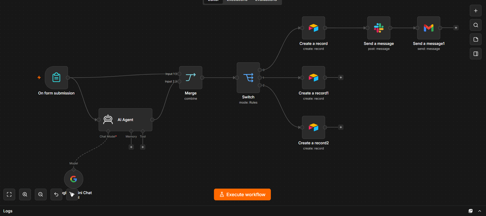

# 🤖 n8n AI Customer Feedback System

An AI-powered customer feedback automation workflow built with **n8n**, **Google Gemini AI**, **Airtable**, **Slack**, and **Gmail**.

The workflow collects customer feedback through a form, uses AI to classify the feedback into **Complaint**, **Compliment**, or **Suggestion**, stores it in the appropriate Airtable table, sends Slack notifications for complaints, and automatically emails customers with an acknowledgment.

---

## 🚀 Features

- Customer feedback form
- AI-powered feedback classification using Google Gemini
- Automatic routing with n8n Switch node
- Store records in separate Airtable tables
- Slack notification for customer complaints
- Automatic email response using Gmail
- No-code workflow automation

---

## 📋 Workflow

1. Customer submits the feedback form.
2. Google Gemini AI analyzes the feedback.
3. AI classifies the response as:
   - Complaint
   - Compliment
   - Suggestion
4. n8n Switch routes the feedback.
5. Data is stored in the corresponding Airtable table.
6. If the feedback is a complaint:
   - Send a Slack notification.
   - Send an acknowledgment email to the customer.

---

## 🛠 Tech Stack

| Component | Purpose |
|-----------|---------|
| n8n | Workflow Automation |
| Google Gemini AI | Feedback Classification |
| Airtable | Customer Feedback Database |
| Slack | Complaint Notifications |
| Gmail | Automated Customer Emails |

---

## 🧠 AI Prompt

The AI Agent analyzes customer feedback and classifies it into exactly one of the following categories:

- complain
- complement
- suggestion

The workflow then routes the response automatically based on the AI output.

---

## 📂 Workflow Architecture

```
Customer Form
      │
      ▼
Google Gemini AI
(Classify Feedback)
      │
      ▼
    Switch
 ┌────┼─────┐
 │    │     │
 ▼    ▼     ▼
Complaint  Compliment  Suggestion
 │          │             │
 ▼          ▼             ▼
Airtable Airtable     Airtable
 │
 ▼
Slack Notification
 │
 ▼
Customer Email
```

---

## ⚙️ Setup Instructions

1. Import `customer-feedback-workflow.json` into n8n.
2. Create three Airtable tables:
   - Complaint
   - Compliment
   - Suggestion
3. Add your credentials:
   - Airtable Personal Access Token
   - Google Gemini API Key
   - Slack OAuth
   - Gmail OAuth
4. Update Airtable Base IDs and Table IDs.
5. Activate the workflow.
6. Submit the customer feedback form.

---

## 📷 Workflow Screenshot

> Replace this screenshot with your own exported workflow.



---

## 💡 Use Cases

- Customer Support Automation
- Feedback Classification
- Complaint Management
- CRM Automation
- AI-powered Helpdesk
- Customer Experience Analytics

---

## 📁 Repository Structure

```
.
├── README.md
├── workflow.png
└── customer-feedback-workflow.json
```

---

## 👨‍💻 Author

**Gaurav Sharma**

GitHub: https://github.com/gaurav2026-gt
